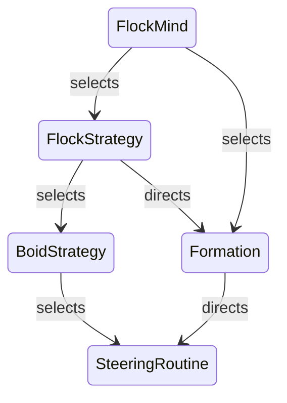

#  IN SPACE IN SPACESHIP DEVDOCS

- WORLD TO LOCAL - inverse transformation you idiot!
- DON'T TRUST DOCUMENTATION. IT's ALL STALE!

## TODO

- [ ] Engine config change notifications
- [ ] Replace `expect` with `unwrap`
- [ ] Consider a bottom up approach to the minds. More complexity at the boid layer.
- [ ] BUG: added implies changed!

- [ ] Surmount technical hurdles
  - [ ] Arrive with velocity
    - [ ] Optimal motion planning? Wtf is that?
- [ ] Refine game loop

- crates to check out
  - [ ] bevy polyline
  - [ ] big brain
  - [ ] bevy remote dev tools

- Consider using arc and weak references to improve performance

- How are we treating unused/expired steering routines?

## design doc

### What we want

#### Features

- [ ] Newtonian flight model
- [ ] Formations
- [ ] Grapple hooks

#### Prior art

- Mount & Blade
- Void Destrotters

#### Focus areas

- Personal combat
- RTS elements
- Living breating world
- Sandbox

### AI

#### Architecture

If we agree that AI needs three abilities:

- Sensors
- Decision making
- Actuation

...we need to design each in an ECS manner.

We'll also need someform of scheduling to distribute work across frames.

- Layers
    - Sensors
        - Are used for process stimuli 
            - Descision makers should be allowed to make own queries
        - Where do they store their stimuli?
            - Must be general enough to allow multiple descision makers to read from them.
            - Blackboard
                - Entities?
                - Resources?
                - Hybrid?
        - Do they run every frame?
        - Idea 0
            - Entity outputs
            - Run every frame.
    - Decision making
        - State
            - Blackboard?
        - A need for frame distribution?
        - Where do they store their results?
            - Specialized?
        - Idea 0
            - Behavior Trees
        - Idea 1
            - Utility AI
                - Big Brain
    - Actuation
        - Specialized per task?
        - Multi frame actions?
            - Action cancelling
                - Stateful?
        - CratEngine input
            - ISIS Godot
        - CraftArms input
            - Bevy Events

#### Minds

- Master
  - scenario orchestration
  - responsiblities
    - assign goals to Tribes
- Tribe
  - faction orchestration
  - responsiblities
    - assign goals to Guys
- Guy
  - interface between Tribe and Flocks/Boids
- Flock
  - responsiblities
    - assign directives to Boids
    - formations
  - directives
    - hold position
    - join formation
    - follow waypoint
    - attack targets
- Boid
  - individual orchestration
  - responsiblities
    - engine inputs
    - arms inputs
        - assign targets to turrents 
  - directives
    - hold position
    - follow waypoint
    - join formation
    - attack target

##### Boid Mind

- Strategies
  - [ ] Attack Persue
  - [ ] Follow Waypoints  
- Steering Behvaiors
  - [x] Seek
  - [x] Intercept
  - [x] Cohesion
  - [x] Separation
  - [x] Alignment
  - [ ] Arrive
    - [x] Arrive with speed
    - [ ] Arrive with velocity

#### Behavior trees

Basic BehaviorTrees that are used for micro deciesion making for sequencing actions. As outlined by [Bobby Anguelov](https://takinginitiative.files.wordpress.com/2020/01/behaviortrees_breaking-the-cycle-of-misuse.pdf), small trees who only affect decisions related to the specfic task, we can avoid complex, hard to extend trees everyone complains about. How will this work out in practice, we'll see I suppose.

#### Formations

Concerns include:

- Varied mechanisms to wait till units are formed.
- Phantom leaders or some mechanism to prevent motion from depending on leaders too much.
- Formations of formations
- Formation lifecycles:
  - Destryoing formation when constraints fail
  - Formation evolution as crafts join/leave

* <https://github.com/libgdx/gdx-ai/wiki/Formation-Motion>
* <https://www.gamasutra.com/view/feature/3314/coordinated_unit_movement.php?print=1>
* <https://sander.landofsand.com/publications/CIG08Heijden.pdf>

Pieces:
- Pivots
  - Pivot motion
    - Copy a leader boid
  - Multi pivot formation
- Slots
  - Assignment strategy
    - Hard roles

- [ ] Simple geometric formations
  - [ ] Sphere
  - [ ] Line
  - [ ] Wall
  - [ ] Delta
- [ ] Dynamic formations
  - [ ] Sine wave
- [ ] Member change handling
  - [ ] Leader change handling
- [ ] Formation constraints
- [ ] Formation lifecycle
  - [ ] Notifications?
- [ ] Slot assignment strategy
  - [ ] Size based?
  - [ ] Class based
  - [ ] Assign to closest slot

## devlog

### -Z is forward

It's either that or -X is right.

### Machine EPSILON

A test for the `smallest_positve_equivalent_angle_rad` on the value `TAU + (PI / 2)` doesn't pass unless I use less than or equal to epsilon. As opposed to less than epsilon. Which I think is pretty damn curious.

### Bug: euler angles for nalgebra

It claims to return roll, pitch yaw but it actually returns pitch, yaw, roll. I'm sure of it.

According to the author:

	Euler angles in nalqebra follows the aircraft convention ,i.e., with yaw the rotation about Z (which is the "up" axis usually chosen in this context).
	Roll: X, Pitch: Y, Yaw: Z
	https://discord.com/channels/507548572338880513/507548945912954881/552583968432586753

### `ii as TReal / RAY_COUNT as TReal != (ii / RAY_COUNT) as TReal`;

Obviously.

### The Overengineering of `ActiveRoutines`

Here's what I want. I want my descision making layer to be able to juggle a number of steering routines, using one in one frame and choosing another in frame two. As I see it, they'll be mostly reusing a few (one, two or three) routines, switching amongst them, I don't want to have to make new Routines everytime the descisions are made. Following?

Steering routines are entities that have a parameter component and systems that batch processes all routines of one kind (in true ECS fashion). All our routines are tagged with the `SteeringRoutine` component. In order to avoid computing work for `SteeringRoutine`s currently not in use, we have an `ActiveRoutine` filter tag for filtering (pre-optimization you dolt!). In essence, the descision maker will tag the routines it wants used with `ActiveRoutine`. Makes sense?

Now, in order to simplfy coding, I broke down the descision making layer into a set of systems/components.

- `RoutineComposer`: composes the output of all the currently `ActiveRoutines` into a single output using some method. (Weighted sum or priority override)
- `Strategy`: this is a yet to be written layer that's supposed to be doing the acutal deciding.

An obvious simplification, as it appeared to me, is instead of having the `Strategy` system tag and detag things, it'll output a `RoutineComposer` component and we'll tag all the currently being composed routines with `ActiveRoutine`. Also, we're mantaining an index of a craft's routines, idekwhy. 

---

I think I miss OOP

---

Composablitiy. I see now that this is driven by a want for composability. I have no idea how this's supposed to help though.

---

I'm 110% sure I over-engineerined every inch of this. Hope it's usable. Also, watch out for everything decomposed to small components/systems.

### Figuring out how to structure the AI

So far, I know that we'll have Boids, i.e. units or single crafts, and the Master, the entity responsible for orchestrating the whole game session for all agents. But there are multitudes of organizational needs beyond the master. To start, we'll have factions in the traditional RTS sense. But then, it starts to get blurry. We'll need some form grouping method to allow the following functions:

- Formations
- Assign common objectives (not necessarily in formation)

These and more I can't think of right now. Also, there should be a fleshed out way to assign objectives without the need for unit groups.

How about we model this along the axis of independence?

- Master: orchestrate gameplay to be fun
- Tribe: orchestrate a single faction
- Flock: A unit or group of units that can recieve orders
  - Must support single boid operations
  - Find a better name
- Boid: a single craft 

### Bug: CCD

Projectiles above 500m/s aren't handled well, watch out.

### My Brain Hurts

I've been trying to come up with a good way to architect the way...flocks? formations? directives? I'm sure I"m missing some more peices there. I don't know! I am unbelievably confused. Something's wrong with me. I can't remember the last time my skull felt this thick.

- We have boids. Boids are single crafts.
- We have flocks. Flocks are a group of boids acting in concert. 
  - They can ***optionally*** be in formation.
    - Quad emphasis on "optional".
- Agents! Agents are the entities that take your orders. Well, most of the time anyways. TODO: find a better name. There are two main kind of agents. Agents that control a single boid and agents that control a single flock. They're the interface between the Tribe/Player and the flocks and boids.
- I want to implement what the gdx-ai literature describes as [Multi-Level Formation][0]. Formations are applied on flocks but a formation itself can be a *formant* in another formation. "formations of formations". 
- So, an order is issued to an agent. Let's say, move to this positin and stay there. Here's the pipeline:
  - Agent recieves order
    - If controlling a single boid
      - Simply arrive at location
    - If controlling a flock
      - If in formation
        - Move lead formatin pivot there
      - If not in formaiton
        - Move center of mass of boids there?
- Simple enough in description. But trying to come up with a elegant, ECS way of making this happpen. MUSH!

[0]: https://github.com/libgdx/gdx-ai/wiki/Formation-Motion#multi-level-formation-motion

What's challenging me:
- Coupling: I'm trying to avoid the different systems from relying on each other too much
- Formation steering! Which system controls directs the formation motion? The first answer would be the FlockStrategies but having to handle the case where there's no formation set. That just fucks me up.
- Formation life-cycle.

Aaaand, yeah. I can see where I went wrong there. Flocks formations aren't really optional.

Coupling graph:

### BUG: Bevy Debug Lines...

...doesn't draw the lines when the camera's in a certain orientation/position

### Arrive With Velocity

Well, this feature, as it turns out, is not an simple generalization of arrive with speed to 3D. From what I can make out online, I'll have to dip my toes into Control Theory and get the grips on something called Optimal Control Theory. It sucks having to derail the dev due to a single feature but...learning is fun I guess. Also, this is a major feature. It will power a major feature anyways. Makes you wonder though, did all who implemented decent formations have to go through this? Maybe there's a simple steering behavior solution I'm missing? 

---

Tried to look up how Homeworld implements formations and even though the question lies unanswered it, the following references should come in handy:

- [Ship class reference][1]
- Seems to be using [waypoints][2] for those fancy maneuvers. They do look look gorgeous, gotta respect the artist.

[1]: https://github.com/HWRM/KarosGraveyard/wiki/Variable;-Ship
[2]: https://github.com/HWRM/KarosGraveyard/wiki/Variable;-Ship

Also, now that I think about it, I don't think the Homewolrd games are newtonian. They don't appear to be so anyways. Not saying it makes their job trivial but yeah.